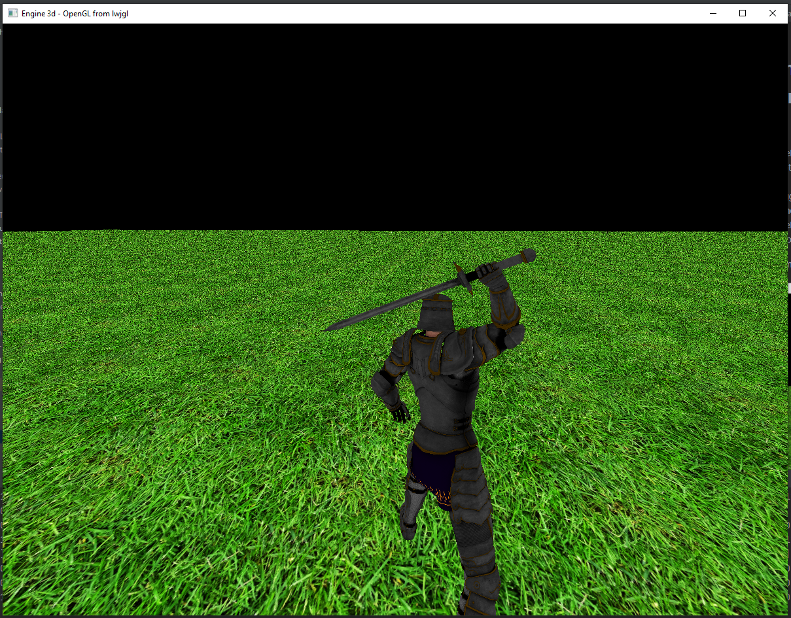
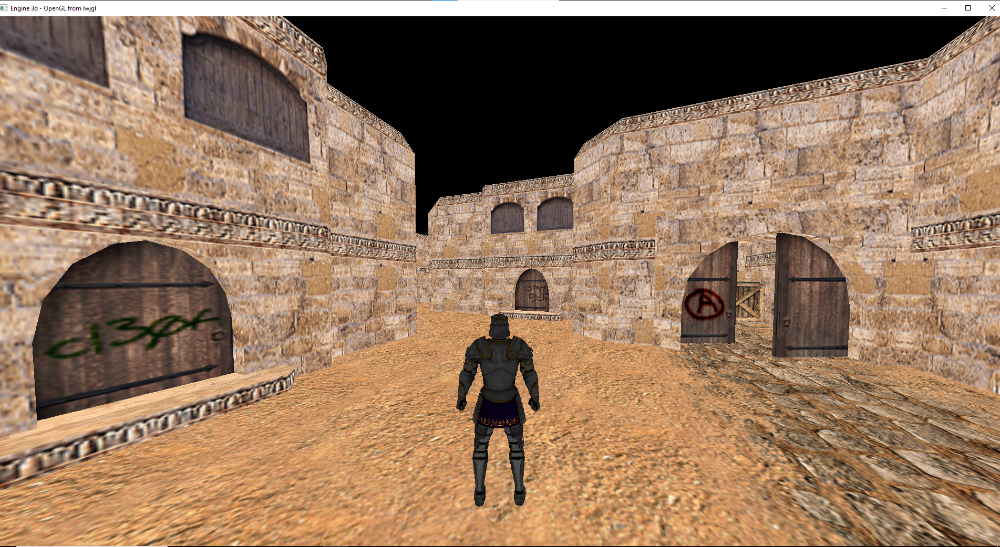

# Simple 3d mmorpg in Java based on lwjgl API for OpenGL

Implemented:
* Rendering 3d glb models with assimp and jgltf,
* Texturing objects by both png and glb extracted by assimp and jgltf,
* Moving camera,
* Skeletal animation (Rigging) with jgltf (for assimp almost works but is a little 
  bugged, for example head of person is in other place),
* Moving player 3d model with camera,
* Basic animations of players movement,
* Rendering test grass floor.

I used free models and animations from Mixamo (https://www.mixamo.com/)

    

    

    

